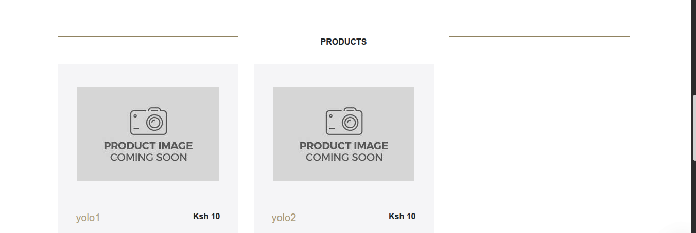
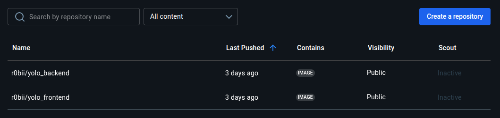

# 🛠️ Project: Yolomy Micro-service

Hey, it's **Robin Adhola** here with a new Independent Project (IP) I've been working on during the past 2 weekends (two IPs in particular), fully from scratch except for some fundamental code for the project, since the existing code and configurations were hectic to continue with.

## 📦 Project Overview

This project is divided into **two main parts**:

### ✅ Part 1: Docker Containerization
- Dockerize a full-stack **Node.js e-commerce application**
- Create custom Docker images for:
  - Frontend (React)
  - Backend (Express + MongoDB)
- Use **Docker Compose** for service orchestration
- Set up **persistent MongoDB storage** using volumes
- Push **versioned Docker images** to DockerHub

### ✅ Part 2: Infrastructure as Code with Vagrant & Ansible
- Use **Vagrant** to provision a local Ubuntu 20.04 virtual machine
- Automate infrastructure setup with **Ansible**:
  - Docker & Docker Compose installation
  - DockerHub image pulling
  - Service deployment
- Organize playbooks using **Ansible Roles**:
  - Frontend
  - Backend
  - MongoDB

---

## 🚀 Getting Started

### 🔧 Prerequisites

Make sure the following tools are installed on your local machine:

- [Git](https://git-scm.com/)
- [Docker](https://www.docker.com/) (also needed in the VM using Vagrant)
- [Docker Compose](https://docs.docker.com/compose/) (also needed in the VM using Vagrant)
- [VirtualBox](https://www.virtualbox.org/)
- [Vagrant](https://www.vagrantup.com/)
- [Ansible](https://www.ansible.com/) (also needed in the VM using Vagrant)

---

## 📥 Clone the Repository

```bash
git clone https://github.com/Rjamez/yolo
cd yolo
```

## 🐳 Running the App with Docker Compose

### Option A: Build Docker Images Locally

```bash
docker-compose up --build
```

### Option B: Use Prebuilt DockerHub Images

Update `docker-compose.yml` like this:

```yaml
services:
  frontend:
    image: r0bii/yolo_frontend:latest
  backend:
    image: r0bii/yolo_backend:latest
```

Then run:

```bash
docker-compose up
```

### 🌐 Access the App

- **Frontend**: http://localhost:3000  
- **Backend**: http://localhost:5000  
- **MongoDB**: Internal on port 27017  

---

## 🧾 Running the App on VM with Vagrant & Ansible

### 🔁 One-Command Setup

```bash
vagrant up
```

The following automated steps take place:

1. A new Ubuntu 20.04 virtual machine is provisioned.
2. Ansible runs automatically using the `playbook.yml` file and an `ansible.cfg` configuration file.
3. The `ansible.cfg` is responsible for:
   - Running all tasks on the local VM (localhost)
   - Defining the remote user (typically your SSH username)
   - Specifying the directory that contains the roles

- **Note**: My playbook.yml is the one that Installs Docker and Docker Compose

The Ansible playbook executes a series of roles in order:

- `mongodb`: Pulls the MongoDB image and starts the container
- `backend`: Pulls the backend image and starts the container
- `frontend`: Pulls the frontend image and starts the container

Each role defines tasks that:

- Pull your Docker images from DockerHub (as listed above)
- Run them in separate, synchronized containers within the VM

Once provisioning completes, your services (frontend, backend, MongoDB) should be running and accessible on their respective ports.

> **Personal note:** For me, configuring `ansible.cfg` and organizing the roles correctly was the most tedious part of the project — but also where most of the learning happened.

---

## ✨ Features

- Add/manage products via the frontend dashboard
- MongoDB data persists with named volumes
- Microservices architecture with isolated containers
- Production-ready DockerHub image versions (latest)
- Fully automated deployment using Vagrant + Ansible

---

## 📸 UI Screenshots

- Yolomy dashboard UI: 
- Product dashboard UI: 
- Products that can be added: 
- Docker Images in Dockerhub: 

---

## ✅ Rubric Checklist

### Dockerization (Part 1)
- Frontend, Backend, and MongoDB containerized
- Orchestration via Docker Compose
- Docker images tagged and pushed to DockerHub
- MongoDB uses named volumes for persistence
- Working UI and screenshots provided
- Clean Git history with meaningful commits

### Configuration Management (Part 2 - Stage 1)
- Ubuntu VM provisioned with Vagrant
- Infrastructure set up with Ansible
- Services managed with Ansible roles
- Docker data persists within VM

---

## Example Git Commit Messages

```bash
commit 1f3cd99880fd0e78e08fe51ae343d023f95e6623
Author: Rjamez
Message: created a new yaml file so as to not have complex code...

commit 4724786e3083aeaa7b769593e4d736ffced86853
Author: Rjamez
Message: added roles for mongo and backend playbook
```

---

## Contact Me

- 📧 Email: [robin.adhola@student.moringaschool.com](mailto:robin.adhola@student.moringaschool.com)
- 🌐 GitHub: [@r0bii](https://github.com/r0bii)

Feel free to fork or clone the repo and try the full DevOps deployment experience! 🎉